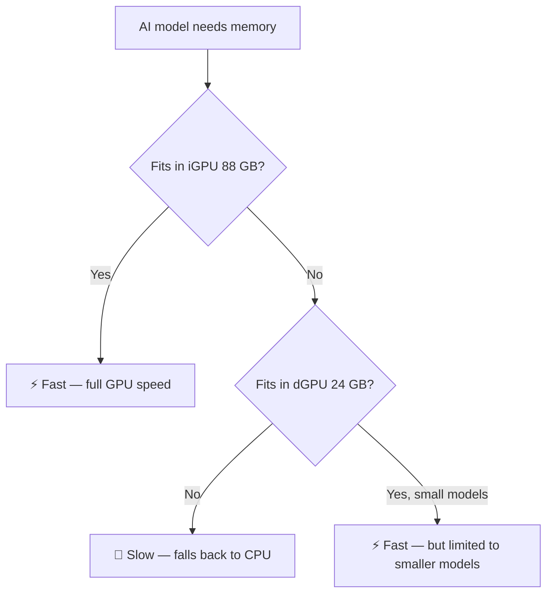

<!--
  rocm-dual-gpu-kit
  Copyright 2026 cubecloud Limited (https://cubecloud.io)
  SPDX-License-Identifier: Apache-2.0
-->

# ROCm Dual-GPU Kit — Plain-Language Overview

> **For non-technical readers**: This page explains what the kit does in plain language, without the technical setup steps. For the full technical guide, see [README.md](README.md).

**Copyright 2026 cubecloud Limited (https://cubecloud.io)** · Licensed under [Apache License 2.0](LICENSE)

---

## What is this kit?

This is a toolkit that helps you set up **two AMD graphics processors (GPUs) on one Windows computer** so they can both work with AMD's ROCm software platform — the layer that lets GPUs accelerate AI and machine learning workloads.

## Why two GPUs?

Many modern AMD computers have **two GPUs built in**:

| GPU | What it is | Memory |
|---|---|---|
| **iGPU** (integrated GPU) | Built into the processor chip | Shares system memory (up to 88 GB on Strix Halo) |
| **dGPU** (discrete GPU) | A separate graphics card | Has its own dedicated memory (e.g., 24 GB on RX 7900 XTX) |

The problem: AMD's ROCm software doesn't automatically configure both GPUs to work at the same time on Windows. Each GPU needs a different software setup, and they can't directly share memory with each other.

## What does the kit do?

The kit solves three problems:

### 1. It makes both GPUs work with ROCm

- The **iGPU** gets configured with a lightweight Python-based ROCm setup (TheRock wheels)
- The **dGPU** gets configured with AMD's official HIP SDK (the system-level installer)
- Both can run ROCm programs independently

### 2. It proves they can share data (with a workaround)

AMD marks most iGPU+dGPU pairs as **"non-peers"** — meaning they can't directly copy data between each other's memory. The kit includes a test program that proves:

- ❌ Direct GPU-to-GPU memory copy: **not possible** (driver limitation)
- ✅ Copy through system memory (host staging): **works** — the software automatically routes data through system RAM as a bridge
- ✅ The data arrives correctly on the other GPU

### 3. It enables dual-GPU acceleration for AI models (via Ollama)

For running local AI models (like Gemma, Qwen, etc.) through Ollama:

- **Two models at once**: Load one large model on the iGPU (88 GB — fits almost any model) and one smaller model on the dGPU (24 GB). Both run at the same time, serving different users or tasks in parallel.
- **Single model**: Runs entirely on the iGPU, which has enough memory for most models up to ~70 billion parameters.

## What was verified?

All findings were tested on real hardware:

| Component | Detail |
|---|---|
| **Processor** | AMD Ryzen AI MAX+ 395 (Strix Halo) |
| **iGPU** | AMD Radeon 8060S Graphics (gfx1151) — 88 GB shared memory |
| **dGPU** | AMD Radeon RX 7900 XTX (gfx1100) — 24 GB dedicated memory |
| **Software** | AMD HIP SDK 7.1.0, TheRock 7.13.0, Ollama 0.30.11 |
| **Driver** | AMD Adrenalin 32.0.31019.2002 |

## Performance: what to expect

**The key takeaway**: The iGPU's 88 GB of shared memory is the biggest advantage of this machine. It can hold almost any AI model entirely in fast GPU memory. The dGPU adds a second lane for running a different model at the same time.

## What does NOT work?

| What | Why |
|---|---|
| Splitting one model across both GPUs | The GPUs can't directly share memory (non-peers); forcing it would be 10-50x slower |
| Using the NPU for AI inference | The NPU (XDNA accelerator) is not supported by Ollama or llama.cpp |
| Reducing iGPU memory to add more system RAM | Would force large models into slow CPU mode — a major downgrade |

## Who is this for?

- **Businesses** running local AI models on AMD hardware without cloud dependencies
- **Developers** who need both GPUs working with ROCm on Windows
- **OEMs** building AMD dual-GPU systems and wanting a reproducible setup

## License

Copyright 2026 cubecloud Limited. Licensed under Apache License 2.0 — free for commercial and personal use.

See [LICENSE](LICENSE) for details.