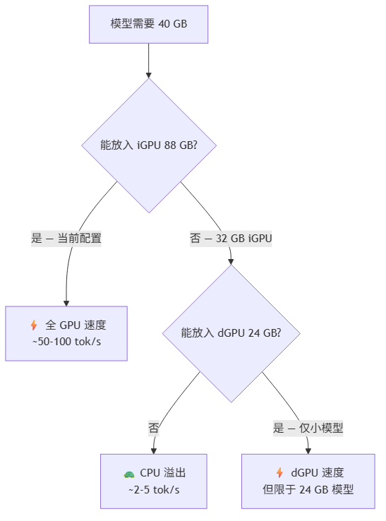

<!--
  rocm-dual-gpu-kit
  Copyright 2026 cubecloud Limited (https://cubecloud.io)
  SPDX-License-Identifier: Apache-2.0
-->

# ROCm 双 GPU 工具包 — 通俗版说明

> **给非技术读者**：本页用通俗语言解释工具包的作用，不涉及技术配置步骤。完整技术指南请见 [README.zh-CN.md](README.zh-CN.md)。

**Copyright 2026 cubecloud Limited (https://cubecloud.io)** · 基于 [Apache License 2.0](LICENSE) 许可

---

## 这个工具包是什么？

这是一个帮助你在**一台 Windows 电脑上同时启用两块 AMD 图形处理器（GPU）**的工具包，让它们都能运行 AMD 的 ROCm 软件平台 —— ROCm 是让 GPU 加速人工智能和机器学习任务的软件层。

## 为什么需要两块 GPU？

很多现代 AMD 电脑内置了**两块 GPU**：

| GPU | 是什么 | 内存 |
|---|---|---|
| **iGPU**（集成显卡） | 内置在处理器芯片中 | 共享系统内存（Strix Halo 上最高 88 GB） |
| **dGPU**（独立显卡） | 单独的显卡 | 有自己的专用内存（如 RX 7900 XTX 的 24 GB） |

问题在于：AMD 的 ROCm 软件在 Windows 上不会自动配置两块 GPU 同时工作。每块 GPU 需要不同的软件设置，而且它们之间不能直接共享内存。

## 工具包做了什么？

工具包解决了三个问题：

### 1. 让两块 GPU 都能运行 ROCm

- **iGPU** 配置了轻量级的 Python 版 ROCm（TheRock 轮子包）
- **dGPU** 配置了 AMD 官方的 HIP SDK（系统级安装包）
- 两块 GPU 都能独立运行 ROCm 程序

### 2. 证明它们可以共享数据（有变通方案）

AMD 把大多数 iGPU+dGPU 组合标记为**"非对等"（non-peers）**—— 意思是它们不能直接在彼此的内存之间拷贝数据。工具包包含一个测试程序，证明了：

- ❌ GPU 之间直接拷贝内存：**不可行**（驱动限制）
- ✅ 通过系统内存中转拷贝：**可行** —— 软件自动通过系统内存作为桥梁传输数据
- ✅ 数据能正确到达另一块 GPU

### 3. 实现双 GPU 加速 AI 模型（通过 Ollama）

对于通过 Ollama 运行本地 AI 模型（如 Gemma、Qwen 等）：

- **同时运行两个模型**：在 iGPU（88 GB —— 几乎能容纳任何模型）上加载一个大模型，在 dGPU（24 GB）上加载一个小模型。两者同时运行，为不同用户或任务并行服务。
- **单个模型**：完全在 iGPU 上运行，其内存足以容纳大多数高达约 700 亿参数的模型。

## 验证了什么？

所有发现均在真实硬件上测试验证：

| 组件 | 详情 |
|---|---|
| **处理器** | AMD Ryzen AI MAX+ 395（Strix Halo） |
| **iGPU** | AMD Radeon 8060S Graphics（gfx1151）— 88 GB 共享内存 |
| **dGPU** | AMD Radeon RX 7900 XTX（gfx1100）— 24 GB 专用内存 |
| **软件** | AMD HIP SDK 7.1.0、TheRock 7.13.0、Ollama 0.30.11 |
| **驱动** | AMD Adrenalin 32.0.31019.2002 |

## 性能：预期效果

**核心结论**：iGPU 的 88 GB 共享内存是这台机器最大的优势。它几乎可以把任何 AI 模型完整放入高速 GPU 内存中。dGPU 则提供了第二条通道，可以同时运行另一个不同的模型。

## 什么做不到？

| 功能 | 原因 |
|---|---|
| 将一个模型拆分到两块 GPU 上 | 两块 GPU 不能直接共享内存（非对等）；强制拆分会慢 10-50 倍 |
| 用 NPU 做 AI 推理 | NPU（XDNA 加速器）不被 Ollama 或 llama.cpp 支持 |
| 减少 iGPU 内存来增加系统内存 | 会迫使大模型进入慢速 CPU 模式 —— 严重降级 |

## 适合谁用？

- **企业**：在 AMD 硬件上运行本地 AI 模型，不依赖云端
- **开发者**：需要在 Windows 上让两块 GPU 都运行 ROCm
- **OEM 厂商**：构建 AMD 双 GPU 系统并希望有可复现的配置方案

## 许可

Copyright 2026 cubecloud Limited。基于 Apache License 2.0 许可 —— 可免费用于商业和个人用途。

详见 [LICENSE](LICENSE)。