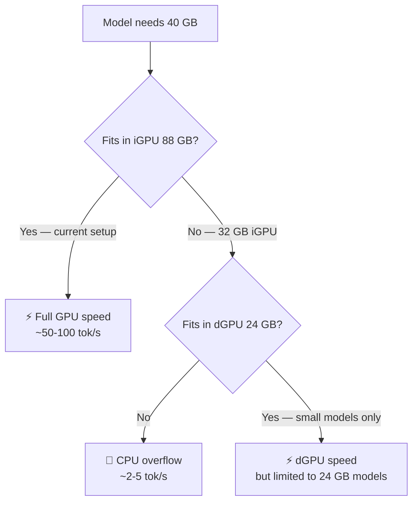

<!--
  rocm-dual-gpu-kit
  Copyright 2026 cubecloud Limited (https://cubecloud.io)
  SPDX-License-Identifier: Apache-2.0
-->

# ROCm Dual-GPU Setup — Method & Tool Kit

> **Languages / 语言 / 言語 / 언어**: [English](README.md) · [简体中文](README.zh-CN.md) · [日本語](README.ja-JP.md) · [한국어](README.ko-KR.md)

**Copyright 2026 cubecloud Limited (https://cubecloud.io)** · Licensed under [Apache License 2.0](LICENSE)

This kit reproduces the **Option 2** dual-GPU pattern that works on:

- **iGPU** (e.g. Strix Halo gfx1151, Strix Point gfx1155, Phoenix gfx1103, Rembrandt gfx1103, Van Gogh gfx1035, etc.) — pinned to **TheRock pip wheels**
- **dGPU** (e.g. Navi 31 / 32 / 33 = gfx1100 / 1101 / 1102; RDNA 4 = gfx1200 / 1201) — pinned to **system HIP SDK**

The recipe was developed on:
- AMD Adrenalin driver 32.0.31019.2002 (Windows)
- AMD HIP SDK 7.1.0 (`C:\Program Files\AMD\ROCm\7.1\`)
- TheRock Python wheels from `https://repo.amd.com/rocm/whl/<target>/` (7.13.0 at the time)
- Python 3.12.10 (system)
- Visual Studio 2022 BuildTools (C++ workload, Windows SDK 10.0.26100)

**Disk budget**: ~22 GB per TheRock venv, ~3 GB HIP SDK. The dGPU side reuses HIP SDK; the iGPU side runs from a venv.

**Versions may have shifted by the time you reuse this kit — the wheels in `https://repo.amd.com/rocm/whl/<target>/` change. The method below is version-stable; the URLs in the example commands are illustrative.**

## Method (six phases)

### Phase 0 — Pre-flight

1. **Driver**: install AMD Adrenalin PRO / Adrenalin (latest WHQL). It enumerates both GPUs to user-mode and exposes `hipInfo` data.
2. **HIP SDK 7.1.0** (or current): install all 8 components. Default install path `C:\Program Files\AMD\ROCm\7.1\`.
3. **Python 3.12.x** (system, e.g. `C:\Program Files\Python312`).
4. **VS 2022 BuildTools** (C++ workload + Windows SDK) at `C:\Program Files (x86)\Microsoft Visual Studio\2022\BuildTools\`. Optional for dGPU C++ compile.
5. Run `hipInfo.exe` from `C:\Program Files\AMD\ROCm\7.1\bin\` and **record** which `gcnArchName` shows up for which device. This is your dGPU's target. Example:

   ```
   device#0  Name: AMD Radeon(TM) 8060S Graphics     gcnArchName: gfx1151   87.87 GB   <- Strix Halo iGPU
   device#1  Name: AMD Radeon RX 7900 XTX             gcnArchName: gfx1100   23.98 GB   <- RDNA3 dGPU
   ```

   **Both GPUs are visible to the driver; one will be your iGPU target, the other the dGPU target.**

### Phase 1 — iGPU venv (TheRock pip wheels)

This phase sets up the iGPU side. The target family comes from the iGPU's `gcnArchName`. **Map your iGPU to the right TheRock wheel index:**

| iGPU | Architecture | TheRock index |
|---|---|---|
| Strix Halo (Ryzen AI MAX 395) | gfx1151 | `gfx1151` |
| Strix Point (Ryzen AI HX 370/470) | gfx1155 | `gfx1151` or `gfx12-generic` (whichever serves) |
| Phoenix (Ryzen 7040HS) | gfx1103 | `gfx110X-all` (broader) |
| Rembrandt (Ryzen 6000) | gfx1103 | `gfx110X-all` |
| Van Gogh (Steam Deck) | gfx1035 | `gfx103X-all` |

When in doubt, list `https://repo.amd.com/rocm/whl/` to see which targets AMD ships wheels for.

```powershell
$ErrorActionPreference = 'Stop'
$INDEX = 'https://repo.amd.com/rocm/whl/gfx1151/'    # <-- set to your iGPU target
$VENV  = 'C:\rocm-sdk'
$PY    = 'C:\Program Files\Python312\python.exe'

# 1. Create venv
& $PY -m venv $VENV\.venv
& "$VENV\.venv\Scripts\python.exe" -m pip install --upgrade pip wheel setuptools

# 2. Pre-download wheels to a local cache (offline-installable later)
$cache = "$VENV\cache"
New-Item -ItemType Directory -Force -Path $cache | Out-Null
& $VENV\.venv\Scripts\python.exe -m pip download --no-deps --no-build-isolation `
    --index-url "$INDEX" --dest $cache `
    rocm_bootstrap rocm-sdk-core rocm-sdk-devel rocm-sdk-libraries-<your-target> rocm

# 3. Install from local cache (no network needed, no wheel-not-found race)
& $VENV\.venv\Scripts\python.exe -m pip install --no-index --find-links $cache --no-build-isolation --no-cache-dir `
    rocm_bootstrap==0.1.0 rocm-sdk-core==<version> rocm-sdk-devel=<version> rocm-sdk-libraries-<your-target>==<version>
& $VENV\.venv\Scripts\python.exe -m pip install --no-index --find-links $cache --no-build-isolation --no-cache-dir rocm

# 4. Smoke test
& $VENV\.venv\Scripts\python.exe -m rocm_sdk version          # <version>
& $VENV\.venv\Scripts\python.exe -m rocm_sdk targets          # your iGPU arch
& $VENV\.venv\Scripts\python.exe -m rocm_sdk test            # 26/26 (1 Linux skip)
& $VENV\.venv\bin\hipInfo.exe                                # enumerates both GPUs; iGPU gcnArch matches
```

**Critical installation rule**: install the 3 wheel packages first, then the `rocm` meta-sdist last. The meta provides the importable `rocm_sdk` module — without it, `python -m rocm_sdk` fails with "No module named rocm_sdk".

### Phase 2 — iGPU env rewire (machine scope, UAC)

```powershell
# Save current env
[Environment]::GetEnvironmentVariables('User') | Export-Clixml "$VENV\env-backup.xml"
[Environment]::GetEnvironmentVariables('Machine') | Export-Clixml "$VENV\env-backup-machine.xml"

# User scope
[Environment]::SetEnvironmentVariable('HIP_PATH',  "$VENV\.venv\Lib\site-packages\_rocm_sdk_core", 'User')
[Environment]::SetEnvironmentVariable('LLVM_PATH', "$VENV\.venv\Lib\site-packages\_rocm_sdk_devel\lib\llvm", 'User')
$userPath = [Environment]::GetEnvironmentVariable('PATH', 'User')
$prepend = "$VENV\.venv\Scripts;$VENV\.venv\Lib\site-packages\_rocm_sdk_core\bin;$VENV\.venv\Lib\site-packages\_rocm_sdk_devel\lib\llvm\bin"
[Environment]::SetEnvironmentVariable('PATH', $prepend + ';' + $userPath, 'User')

# Machine scope (UAC)
$msiPath = [Environment]::GetEnvironmentVariable('PATH', 'Machine')
Start-Process powershell -ArgumentList '-NoProfile','-Command',`
    "[Environment]::SetEnvironmentVariable('HIP_PATH','$VENV\.venv\Lib\site-packages\_rocm_sdk_core','Machine'); " + `
    "[Environment]::SetEnvironmentVariable('PATH','$VENV\.venv\Scripts;$VENV\.venv\Lib\site-packages\_rocm_sdk_core\bin;' + `$msiPath,'Machine')" `
    -Verb RunAs -Wait

# Verify in a fresh shell
Start-Process pwsh -ArgumentList '-NoProfile','-Command','Get-Command hipconfig,hipcc,rocm-sdk,clang | Select-Object Name,Source' -Wait -NoNewWindow
```

### Phase 3 — dGPU env (HIP SDK on demand)

The dGPU side **does not** need a venv. The system HIP SDK 7.1.0 already enumerates the dGPU. Activation just clears the iGPU venv's `HIP_PATH` shadow and prepends HIP SDK's `bin`/`lib`.

Drop `activate-dgpu.ps1` and `deactivate-dgpu.ps1` (in this kit) at any directory, e.g. `C:\rocm-sdk-dgpu\`. They take a snapshot of the current env on activate and restore on deactivate.

### Phase 4 — dGPU C++ compile (when needed)

Two patterns:

**Pattern A: run a prebuilt .exe** (kernel already compiled). Just `activate-dgpu.ps1` then `HIP_VISIBLE_DEVICES=1 my_program.exe`.

**Pattern B: compile from source**. HIP SDK 7.1.0's `clang.exe` does NOT bundle MSVC integration. You must point it at the local Visual Studio BuildTools and Windows SDK. Use the included `dgpu-build-template.ps1` as a starting point.

Critical flag: `--offload-arch=<your-dgpu-arch>`. HIP SDK's clang defaults to `gfx906` which will produce "device kernel image is invalid" at runtime if your dGPU is different.

### Phase 5 — Validation

```powershell
# iGPU (default shell, in any terminal)
& C:\rocm-sdk\.venv\Scripts\python.exe -m rocm_sdk test       # 26/26 (1 Linux skip)

# dGPU (after activate-dgpu.ps1)
hipInfo                                                      # both devices
$env:HIP_VISIBLE_DEVICES = '1'; hipInfo                      # dGPU only
& C:\rocm-sdk-dgpu\vector_add.exe                            # prebuilt kernel, gfx1100
```

## Adapting to other hardware

| Hardware | What to change | What stays the same |
|---|---|---|
| **Strix Point (HX 370/470) iGPU (gfx1155)** | TheRock index: `gfx1151` (try) or `gfx12-generic` (if available); `-libraries-gfx1151` may be needed | Phases 1-5 same |
| **Rembrandt / Phoenix (gfx1103) iGPU** | TheRock index: `gfx110X-all`; `-libraries-gfx110x-all` | Phases 1-5 same |
| **RX 7600 XT (gfx1100) dGPU** | `--offload-arch=gfx1100`; HIP SDK 7.1.0 already supports it | Phase 4 only |
| **RX 9070 / 9070 XT (RDNA 4, gfx1201) dGPU** | `--offload-arch=gfx1201`; check HIP SDK version supports gfx1201 (7.1.0+ may need update) | Phase 4 only; possibly upgrade HIP SDK |
| **RDNA 2 (gfx1031, e.g. RX 6600) dGPU** | `--offload-arch=gfx1031`; check HIP SDK support | Phase 4 only |
| **No Visual Studio BuildTools** | dGPU C++ compile won't work; Python venv side is unaffected | Phase 4 fails; runtime works |
| **No system HIP SDK** | dGPU side has nothing to fall back to; if you only have TheRock wheels for your dGPU target, install a TheRock dGPU venv the same way as Phase 1 | n/a |

## Key constraints / invariants

- **The driver is the source of truth for which `gcnArchName` each device has**. Always run `hipInfo` from each ROCm install and confirm the targets before committing to a setup.
- **Driver-level non-peers**: even when both GPUs are visible, AMD marks most iGPU/dGPU pairs as `non-peers` (e.g. Strix Halo + RX 7900 XTX, gfx1151 + gfx1100). Direct GPU-GPU copy is not possible. Use host-memory staging.
- **TheRock sdist flavor**: the `rocm-7.X.tar.gz` sdist from `https://repo.amd.com/rocm/whl/<target>/` is **target-specific** (different MD5 per index). Always download the sdist from the **same** index as your libraries wheel.
- **Wheels index cache pollution**: if you see "No such file or directory: <abs_path>" from `pip install --find-links`, delete any `*_index.html` files left in the cache from a previous attempt — pip misreads them as PEP 503 simple pages with `../` relative paths.
- **HIP_PATH shadowing**: HIP SDK 7.1.0's `hipconfig` reads `HIP_PATH` from env. If the iGPU venv sets `HIP_PATH`, HIP SDK's `hipconfig` reports the iGPU venv's paths. The activation script must clear `HIP_PATH` and set it to the HIP SDK dir.
- **hipcc.bat with paths containing spaces** doesn't work (it tokenizes on spaces). Invoke `clang.exe` directly with `--driver-mode=g++ --hip-link`.

## Ollama dual-GPU acceleration (v1.2.0)

This kit now includes tools to accelerate local LLM inference using both GPUs simultaneously.

### Non-peers VRAM test

Run `test-peer-vram.ps1` to verify the non-peers constraint and the host-memory staging workaround on your box:

```
hipDeviceCanAccessPeer(0->1): 0        ← no direct peer access
hipDeviceCanAccessPeer(1->0): 0        ← no direct peer access
hipDeviceEnablePeerAccess(1,0): err=101  ← peer enable fails
hipMemcpyPeer(d0<-d1): err=0 (no error)  ← but the copy WORKS
PEER COPY: PASS (transparent host staging by HIP runtime)
STAGING COPY: PASS
```

**Finding**: The iGPU and dGPU **can** copy VRAM between each other — just not via direct peer-to-peer. HIP SDK 7.1.0's `hipMemcpyPeer` transparently falls back to host-memory staging when peer access is unavailable, and the data round-trips correctly.

### Ollama scheduler behavior

Ollama's scheduler is **architecturally single-GPU-per-model**:

| Behavior | Detail |
|---|---|
| `NO_PEER_COPY=1` | Set by llama.cpp when non-peers detected |
| GPU selection | Scheduler picks one GPU per model load (`sched.go:1024`) |
| Overflow | When a model exceeds one GPU's VRAM, it overflows to **system RAM (CPU)**, not the other GPU |
| `LLAMA_ARG_SPLIT_MODE=layer` | Inherited by llama-server but doesn't work — runner doesn't pass `--device 0,1` |
| `LLAMA_ARG_DEVICE=0,1` | Crashes: `invalid device: 0` (bundled binary has no GPU support compiled in) |

### Working: two models, two GPUs (Option 1)

`configure-ollama-dual-gpu.ps1` sets user-level env vars and gracefully restarts the Ollama tray app:

```powershell
.\configure-ollama-dual-gpu.ps1          # apply config
.\configure-ollama-dual-gpu.ps1 -Revert  # revert to default
```

After running it, load two models:
- Large model (e.g., `gemma4:26b-a4b-it-q8_0`, ~28 GB) → lands on iGPU (87 GB)
- Small model (e.g., `gemma4:12b-it-q8_0`, ~12 GB) → lands on dGPU (24 GB)

Concurrent requests to different models run in parallel on different GPUs.

### Performance bottleneck hierarchy



| Layer | Bandwidth | Role |
|---|---|---|
| **GPU VRAM** (iGPU 88 GB / dGPU 24 GB) | ~500 GB/s | Matrix math in parallel — fast |
| **System RAM** (64 GB DDR5) | ~90 GB/s | CPU overflow — 10-50x slower than GPU |
| **NPU** (XDNA on Strix Halo) | N/A | **Not used** by Ollama/llama.cpp |

### Recommendation

| Workload | Best approach |
|---|---|
| Single large model (≤ 87 GB) | Use iGPU alone (87 GB VRAM fits most models) |
| Multiple users / models | Option 1: two models, two GPUs (`configure-ollama-dual-gpu.ps1`) |
| Model too large for iGPU alone | Reduce context size (`OLLAMA_CONTEXT_LENGTH=32768`) or use Q4 quantization |

**Do not reduce iGPU VRAM to add more system RAM.** The iGPU's 87 GB unified memory is the single biggest advantage of this box. CPU overflow is 10-50x slower than GPU. The NPU (XDNA) is not used by Ollama/llama.cpp.

## Files in this kit

```
C:\therock\rocm-dual-gpu-kit\
├── README.md                       <- this file (English)
├── README.zh-CN.md                 <- 简体中文
├── README.ja-JP.md                 <- 日本語
├── README.ko-KR.md                 <- 한국어
├── LICENSE                         <- Apache License 2.0 (full text)
├── NOTICE                          <- copyright + attribution
├── kit.json                        <- kit metadata
├── AGENTS.md                       <- agent quick-start contract
├── SKILL.md                        <- structured skill format
├── install-igpu-venv.ps1            <- Phase 1: auto-detect + install
├── rewire-igpu.ps1                 <- Phase 2: machine-scope env (UAC)
├── activate-dgpu.ps1               <- Phase 3: HIP SDK activation
├── deactivate-dgpu.ps1             <- Phase 3: restore
├── dgpu-build-template.ps1         <- Phase 4: clone & customize for your dGPU
├── detect-hardware.ps1             <- detect iGPU/dGPU + their gcnArchName + HIP SDK presence
├── validate.ps1                    <- Phase 5: end-to-end smoke test
├── diagnose-connection.ps1         <- Phase 5.5: read-only transport diagnostic
├── dgpu-probe.ps1                  <- optional: finer-grained PnP probe
├── peer_vram_test.cpp              <- v1.2.0: HIP C++ non-peers VRAM test
├── test-peer-vram.ps1              <- v1.2.0: compile + run peer_vram_test
├── configure-ollama-dual-gpu.ps1   <- v1.2.0: Ollama dual-GPU config + tray restart
├── start-dual-gpu-ollama.ps1       <- v1.2.0: standalone Ollama launcher (superseded)
└── start-split-model.ps1           <- v1.2.0: forced layer split attempt (limited)
```

## License & Copyright

This kit is **Copyright 2026 cubecloud Limited (https://cubecloud.io)** and licensed under the **Apache License, Version 2.0**.

See [LICENSE](LICENSE) for the full text and [NOTICE](NOTICE) for attribution details.

### Why Apache 2.0

| Reason | Benefit for cubecloud |
|---|---|
| Same license as AMD ROCm and TheRock | No license conflict in the same ecosystem |
| Explicit patent grant + retaliation clause | Protects us from patent claims by downstream users |
| Permissive: commercial use, modification, distribution | Doesn't block cubecloud's commercial use of this kit internally |
| Compatible with GPLv3 | Downstream can relicense under GPL if they want |
| Industry standard for hardware/compute tooling | Recognized and trusted by enterprise users |
| Requires preservation of copyright + license | Attribution to cubecloud Limited persists in all copies |
| Trademarks (AMD, Radeon, ROCm, etc.) are NOT licensed | We're not giving away AMD's marks; we just document how to use them |

### Trademarks / attribution

- AMD, Radeon, ROCm, HIP, Adrenalin, Strix Halo, RDNA are trademarks of Advanced Micro Devices, Inc.
- This kit is not affiliated with, endorsed by, or sponsored by AMD.
- "cubecloud" and "cubecloud.io" are trademarks of cubecloud Limited.

### Third-party components (NOT redistributed by this kit)

This kit does not include ROCm, TheRock, HIP SDK, or any AMD binaries. It is a configuration / orchestration layer that points to AMD's official install paths and to AMD's official Python wheel index. Refer to AMD's licenses for those components.

| Component | License | Source |
|---|---|---|
| AMD ROCm / TheRock | Apache 2.0 | https://github.com/ROCm/TheRock |
| AMD HIP SDK | MIT (per AMD installer EULA) | AMD installer |
| Python 3.12 | PSF License | https://www.python.org |
| Visual Studio BuildTools | Microsoft EULA | https://visualstudio.microsoft.com |

If you fork this kit or reuse it commercially, please retain the `cubecloud Limited` copyright in the file headers, the `LICENSE` file, and the `NOTICE` file.

All scripts in this kit are **parameterized** — they read hardware from `hipInfo` output and adapt. Run `detect-hardware.ps1` first to see what your target box has.
