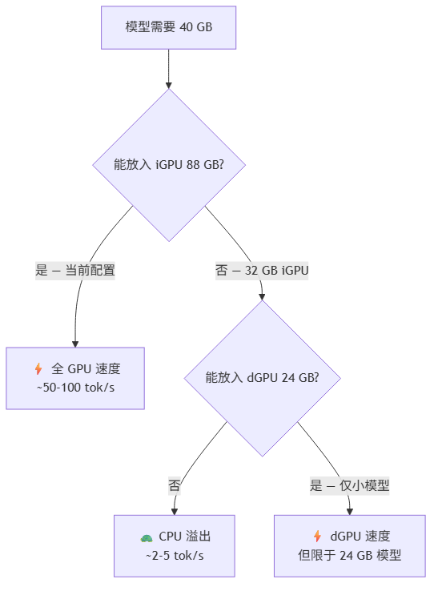

<!--
  rocm-dual-gpu-kit
  Copyright 2026 cubecloud Limited (https://cubecloud.io)
  SPDX-License-Identifier: Apache-2.0
-->

# ROCm Dual-GPU Kit

> Reproducible AMD dual-GPU ROCm setup for Windows. Get both your iGPU and dGPU working together for AI acceleration.

**Copyright 2026 cubecloud Limited (https://cubecloud.io)** · Licensed under [Apache License 2.0](LICENSE)

**Languages / 语言 / 言語 / 언어**: [English](README.md) · [简体中文](README.zh-CN.md) · [日本語](README.ja-JP.md) · [한국어](README.ko-KR.md) · [Plain-Language Overview (EN)](OVERVIEW.md) · [通俗版说明 (ZH)](OVERVIEW.zh-CN.md)

---

## What is this?

A toolkit that configures **two AMD graphics processors on one Windows computer** so they can both accelerate AI and machine learning workloads using AMD's ROCm platform.

## Why two GPUs?

Many modern AMD computers have **two GPUs built in**:

| GPU | What it is | Memory |
|---|---|---|
| **iGPU** (integrated) | Built into the processor | Shares system memory (up to 88 GB on Strix Halo) |
| **dGPU** (discrete) | A separate graphics card | Has its own dedicated memory (e.g., 24 GB on RX 7900 XTX) |

The problem: AMD's ROCm software doesn't automatically configure both GPUs to work at the same time on Windows. Each GPU needs a different software setup, and they can't directly share memory with each other.

## What does the kit achieve?

### ✅ Both GPUs work with ROCm

- The **iGPU** gets a lightweight Python-based ROCm setup (TheRock wheels)
- The **dGPU** gets configured with AMD's official HIP SDK
- Both can run ROCm programs independently

### ✅ Data sharing between GPUs (with workaround)

AMD marks most iGPU+dGPU pairs as **"non-peers"** — they can't directly copy data between each other's memory. The kit includes a test program that proves:

- ❌ Direct GPU-to-GPU memory copy: **not possible** (driver limitation)
- ✅ Copy through system memory (host staging): **works** — the software automatically routes data through system RAM as a bridge
- ✅ The data arrives correctly on the other GPU

### ✅ Dual-GPU acceleration for AI models

For running local AI models through Ollama, LM Studio, or Lemonade Server:

- **Two models at once**: Load one large model on the iGPU (88 GB — fits almost any model) and one smaller model on the dGPU (24 GB). Both run at the same time, serving different users or tasks in parallel.
- **Single model**: Runs entirely on the iGPU, which has enough memory for most models up to ~70 billion parameters.
- **NPU support**: LM Studio and Lemonade Server support the NPU (XDNA accelerator), which can offload part of the AI inference workload alongside the GPUs.

## Why add a dGPU?

The purpose of adding a dGPU is not to reduce iGPU memory, but to **share the heavy workload with the iGPU**. When the iGPU is processing a large model, the dGPU can simultaneously run another model or handle other inference tasks, **accelerating overall model inference throughput**. Each GPU handles its own tasks, working together for higher total performance.

## Performance: what to expect



**The key takeaway**: The iGPU's 88 GB of shared memory is the biggest advantage of this machine. It can hold almost any AI model entirely in fast GPU memory. The dGPU adds a second lane for running a different model at the same time.

## What does NOT work?

| What | Why |
|---|---|
| Splitting one model across both GPUs | The GPUs can't directly share memory (non-peers); forcing it would be 10-50x slower |

## Verified on

| Component | Detail |
|---|---|
| **Processor** | AMD Ryzen AI MAX+ 395 (Strix Halo) |
| **iGPU** | AMD Radeon 8060S Graphics (gfx1151) — 88 GB shared memory |
| **dGPU** | AMD Radeon RX 7900 XTX (gfx1100) — 24 GB dedicated memory |
| **NPU** | AMD XDNA2 (Strix Halo) — third accelerator via Lemonade + FastFlowLM (v1.3.0) |
| **Software** | AMD HIP SDK 7.1.0, TheRock 7.13.0, Ollama 0.30.11, Lemonade 2026.39.1 |
| **Driver** | AMD Adrenalin 32.0.31019.2002 |

## Who is this for?

- **Businesses** running local AI models on AMD hardware without cloud dependencies
- **Developers** who need both GPUs working with ROCm on Windows
- **OEMs** building AMD dual-GPU systems and wanting a reproducible setup

## Quick start

1. **Detect your hardware**: `.\detect-hardware.ps1`
2. **Install iGPU ROCm**: `.\install-igpu-venv.ps1`
3. **Rewire environment**: `.\rewire-igpu.ps1`
4. **Validate**: `.\validate.ps1`
5. **Configure Ollama dual-GPU**: `.\configure-ollama-dual-gpu.ps1`

> ⚠️ Requires AMD Adrenalin driver, HIP SDK 7.1.0+, Python 3.12, and Windows 11.

## Documentation

| Document | Audience | Content |
|---|---|---|
| [OVERVIEW.md](OVERVIEW.md) | Non-technical readers | Plain-language summary (English) |
| [OVERVIEW.zh-CN.md](OVERVIEW.zh-CN.md) | 非技术读者 | 通俗版说明（中文） |
| [TECHNICAL.md](TECHNICAL.md) | Developers / engineers | Full technical guide with all phases, env vars, and commands |
| [README.zh-CN.md](README.zh-CN.md) | 开发者 | 完整技术指南（中文） |
| [AGENTS.md](AGENTS.md) | AI agents | Quick-start contract for coding agents |
| [SKILL.md](SKILL.md) | AI agents | Structured skill format |
| [kit.json](kit.json) | Machine-readable | Metadata, changelog, entry points |

## Files in this kit

```
rocm-dual-gpu-kit/
├── README.md                       <- this file (front page, plain language)
├── OVERVIEW.md                     <- plain-language overview (English)
├── OVERVIEW.zh-CN.md               <- 通俗版说明（中文）
├── OVERVIEW.zh-CN.pdf              <- PDF version for distribution
├── TECHNICAL.md                    <- full technical guide (was README.md)
├── README.zh-CN.md                 <- 完整技术指南（中文）
├── README.ja-JP.md                 <- 日本語技術ガイド
├── README.ko-KR.md                 <- 한국어 기술 가이드
├── AGENTS.md                       <- agent quick-start contract
├── SKILL.md                        <- structured skill format
├── kit.json                        <- kit metadata
├── diagram.png                     <- performance bottleneck hierarchy diagram
├── LICENSE                         <- Apache License 2.0
├── NOTICE                          <- copyright + attribution
│
├── detect-hardware.ps1             <- detect iGPU/dGPU + arch + HIP SDK
├── install-igpu-venv.ps1           <- install iGPU TheRock venv
├── rewire-igpu.ps1                 <- machine-scope env rewire (UAC)
├── rollback-rewire.ps1             <- undo the rewire
├── activate-dgpu.ps1               <- activate dGPU HIP SDK env
├── deactivate-dgpu.ps1             <- restore from dGPU activation
├── dgpu-build-template.ps1         <- compile HIP C++ for dGPU
├── dgpu-probe.ps1                  <- finer-grained PnP probe
├── validate.ps1                    <- end-to-end smoke test
├── diagnose-connection.ps1         <- read-only transport diagnostic
├── peer_vram_test.cpp              <- v1.2.0: HIP C++ non-peers VRAM test
├── test-peer-vram.ps1              <- v1.2.0: compile + run peer VRAM test
├── configure-ollama-dual-gpu.ps1   <- v1.2.0: Ollama dual-GPU config + tray restart
├── start-dual-gpu-ollama.ps1       <- v1.2.0: standalone Ollama launcher (superseded)
├── start-split-model.ps1           <- v1.2.0: forced layer split attempt (limited)
├── install-npu-lemonade.ps1        <- v1.3.0: XDNA2 NPU bring-up (Lemonade + FastFlowLM)
└── validate-npu.ps1                <- v1.3.0: NPU benchmark via running server
```

## License & Copyright

Copyright 2026 cubecloud Limited. Licensed under Apache License 2.0 — free for commercial and personal use.

- AMD, Radeon, ROCm, HIP, Adrenalin, Strix Halo, RDNA are trademarks of Advanced Micro Devices, Inc.
- This kit is not affiliated with, endorsed by, or sponsored by AMD.
- "cubecloud" and "cubecloud.io" are trademarks of cubecloud Limited.

See [LICENSE](LICENSE) for full text and [NOTICE](NOTICE) for attribution.